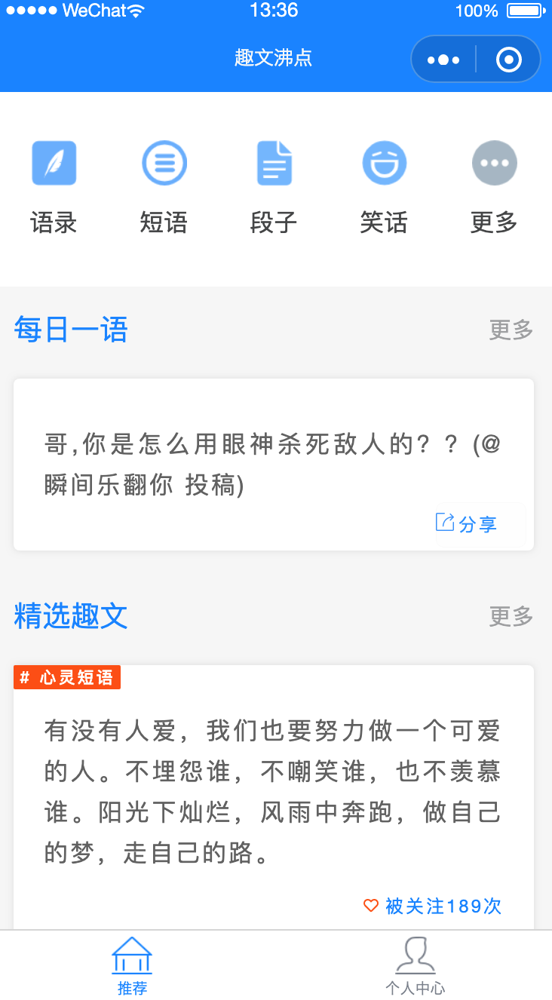
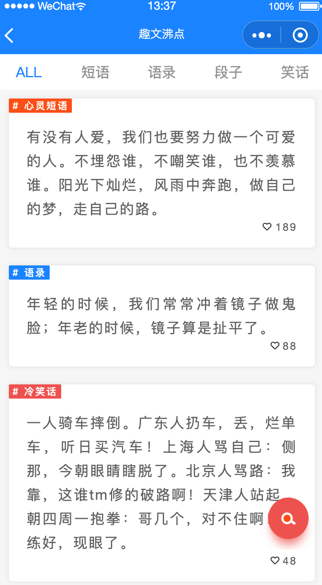
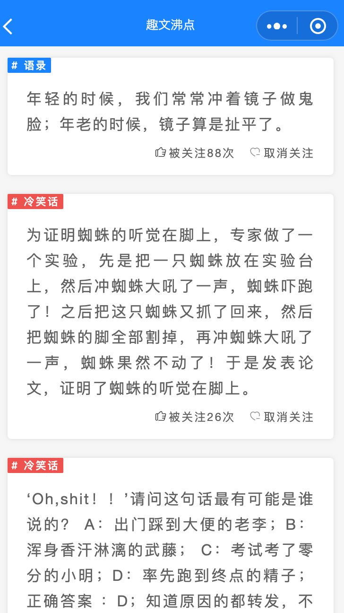

### 趣文沸点

一个在线 语录、格言、段子查询类工具 （附加 机器翻译、智能聊天、图片识别、图片特效等功能）

### 小程序功能

- 推荐页面
  -  每日一语
  -  精选趣文
- 查询列表页面
- 搜索页面
- 我的页面
- 我的关注
- 沸点
  - 机器翻译
  - 智能聊天
  - 图片识别 [ TODO ]
  - 图片特效 [ TODO ]

#### 依赖腾讯AI 接口

```js

const AI_PREFIX = "https://api.ai.qq.com/fcgi-bin/";

module.exports = {
  "nlp_textchat":  AI_PREFIX + "nlp/nlp_textchat", // 智能闲聊
  "vision_imgtotext":  AI_PREFIX + "vision/vision_imgtotext", // 看图说话
  "image_fuzzy": "image_fuzz AI_PREFIX + yimage/image_fuzzy",// 模糊图片识别
  "image_food":  AI_PREFIX + "image/image_food", // 美食图片识别
  "vision_scener":  AI_PREFIX + "vision/vision_scener", // 场景识别
  "vision_objectr":  AI_PREFIX + "vision/vision_objectr", // 物体识别
  "nlp_imagetranslate":  AI_PREFIX + "nlp/nlp_imagetranslate", // 图片翻译,
  "nlp_speechtranslate": AI_PREFIX + "nlp/nlp_speechtranslate", // 语音翻译
  "nlp_texttranslate": AI_PREFIX + "nlp/nlp_texttranslate" // 文本翻译(翻译君)
}

````

#### 签名相关逻辑

```js

function getNonce(len) {
  let str = 'abcdefghijklmnopqrstuvwxyz0123456789ABCDEFGHIJKLMNOPQRSTUVWXYZ';
  let newStr = [];
  for(let i = 0; i < len; i ++) {
    let index =  Math.floor(Math.random() * (str.length - 0)) + 0;
    newStr.push(str.charAt(index));
  }
  return newStr.join('');
}


function ksort(obj) {
  let keys = Object.keys(obj).sort();
  let newObj = [];

  for (var i = 0; i < keys.length; i ++) {
    let k = keys[i], v = obj[k];

    if (v !== '') {
      let _v = encodeURIComponent(obj[k]);
      _v = _v.replace(/%20/ig, '+');
      newObj.push(`${k}=${_v}`);
    }
  }
  return newObj.join('&');
}

function getReqSign(param, appKey) {
  let t = ksort(param);
  let s = t +`&app_key=${appKey}`;

  return Md5(s).toUpperCase();
}


function getParam(data) {
  let newData = Object.assign(data, {
    "app_id": APP_ID,
    "time_stamp": timeStamp(),
    "nonce_str": getNonce(16)
  });

  let sign = getReqSign(newData, APP_KEY);
  return Object.assign(data, {
    "sign": sign
  });
}

function jsonToStringMp(data) {
  let ars = [];
  for(var k in data) {
    ars.push(encodeURIComponent(k) + '=' + encodeURIComponent(data[k]));
  }
  return ars.join('&');
}

function aiReq(param) {
  let _data = getParam(param.data);
  if (param.method && param.method.toLocaleUpperCase() == 'POST') {
    _data = jsonToStringMp(_data);
  }
  wx.request({
    url: param.url,
    header: { // POST请求时为 application/x-www-form-urlencoded
      "Content-Type": param.header || "application/json"
    },
    data: _data, // POST时 为 UTF-8 键值对字符串
    method: param.method || 'GET',
    dataType: param.dataType || 'json',
    responseType: param.responseType || 'text',
    success: param.success || null,
    fail: param.fail || null,
    complete: param.complete || null
  });
}

````


#### 最终效果


#### 部分页面







